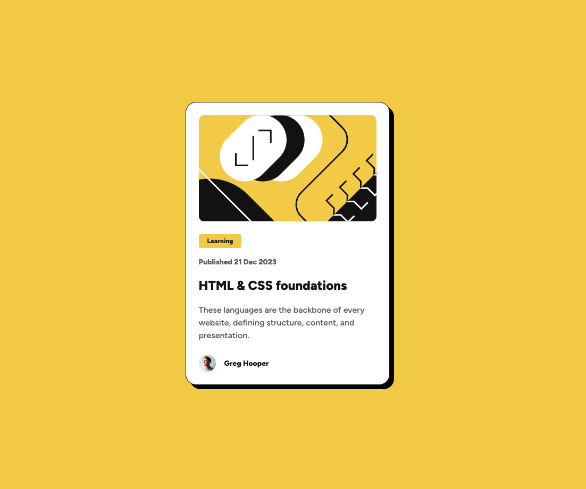

# Frontend Mentor - Blog Preview Card Solution

This is my solution to the [Blog Preview Card Component Challenge on Frontend Mentor](https://www.frontendmentor.io/challenges/blog-preview-card-ckPaj01IcS). Frontend Mentor challenges help developers improve their coding skills by building realistic projects.

## Table of Contents

- [Overview](#overview)
  - [Screenshot](#screenshot)
  - [Links](#links)
- [My Process](#my-process)
  - [Built With](#built-with)
  - [Useful Resources](#useful-resources)
  - [Author](#author)
  - [What I Learned](#what-i-learned)
  - [Continued Development](#continued-development)

## Overview

### Screenshot



### Links

- [Solution Repository](https://github.com/wiceldric75/blog-preview-card-component) 
- [Live Demo](https://wiceldric75.github.io/blog-preview-card-component/)

## My Process
- **Setup**: Structured the project with semantic HTML5 and external CSS, importing the "Figtree" font via Google Fonts.
- **HTML**: Designed a clean and accessible layout using descriptive class names and logical content hierarchy.
- **CSS**: Implemented custom properties for colors, typography, and spacing. Used Flexbox for layout and a mobile-first workflow to ensure responsiveness. Background images were added with attention to alignment and scaling.
- **Testing**: Verified design accuracy and responsiveness across multiple screen sizes.
- **Refinement**: Iteratively adjusted styles to ensure alignment with the design specifications, focusing on spacing, typography, and layout.

### Built With

- Semantic HTML5 markup
- CSS custom properties
- Flexbox
- Mobile-first workflow

### Useful Resources

- [MDN Web Docs - CSS Backgrounds](https://developer.mozilla.org/en-US/docs/Web/CSS/background) - Helped in applying and positioning the background image effectively.
- [Frontend Mentor Slack Community](https://www.frontendmentor.io/slack) - Provided support and feedback during this challenge.
- [CSS Tricks - Flexbox Guide](https://css-tricks.com/snippets/css/a-guide-to-flexbox/) - Helped structure the layout efficiently.

### Author
- I have over 20 years of professional development experience, starting with a decade in embedded systems where I worked with assembly, C, and C++. For the past 10+ years, I’ve specialized in iPhone application development using Objective-C and Swift. Recently, I’ve ventured into starting my own business, which sparked my interest in web development. After spending months studying HTML, CSS, and JavaScript to build a strong theoretical foundation, I’m now putting those skills into practice through hands-on challenges like those offered by Frontend Mentor.

- **GitHub**: [wiceldric75](https://github.com/wiceldric75)
- **Frontend Mentor**: [@YourFrontendMentorUsername](https://www.frontendmentor.io/profile/wiceldric75)

### What I Learned

This challenge provided valuable insights into creating reusable and scalable components using custom properties and typography presets. Key learnings include:
- Using **CSS custom properties** to maintain consistent styling for spacing, colors, and typography.
- Structuring components with **Flexbox** for alignment and responsiveness.
- Applying background images with attention to scaling, centering, and aspect ratio preservation.

Here’s a snippet of CSS I’m particularly proud of:
```css
#innerSection {
  display: flex;
  width: 327px;
  padding: var(--spacing-200, 24px);
  flex-direction: column;
  align-items: flex-start;
  gap: var(--spacing-200, 24px);
  border-radius: 20px;
  background: var(--color-white, #fff);
  box-shadow: 8px 8px 0px 0px #000;
}
